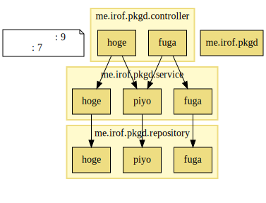
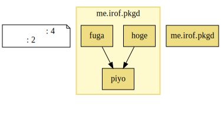
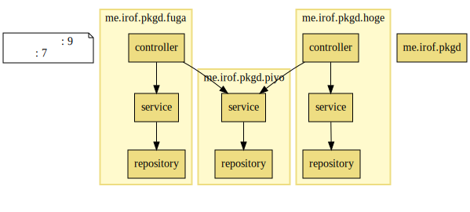

パッケージ設計
============================================================

パッケージ設計のサンプルです。
パッケージ関連図は [JIG](https://github.com/dddjava/jig) で出力しています。
現場状況やプロダクトに応じて適切なものは異なり、正解がどれとかはないです。
「コメント」は主観です。

- コンポーネント
  - ここでは実装技術によるものをコンポーネントと呼びます。
  - `controller` `service` `repository` が該当します。
- 機能
  - アプリケーション固有の機能のことです。
  - `hoge` `fuga` `piyo` が該当します。

## コンポーネント/機能

コンポーネントパッケージの中に機能パッケージを作るパターンです。

[コード例](https://github.com/irof/package-design/tree/component-function/src/main/java/me/irof/pkgd)

横にコンポーネントによるレイヤが見えます。

### 採用傾向
- 実装技術が主たる関心ごと
  - たとえば実装技術によって担当者が異なる
- それぞれの箱を開発単位とした進め方をする
- すべての機能で作りを統一したい
- なんとなく

### コメント
真似しやすいからか、多くの現場で見かけます。

すべてのコンポーネントの中に同じパッケージが並ぶことが多く、賽の目構造になりがち。
特定機能を追うにはパッケージを飛び回る必要が出てきます。

コンポーネントパッケージを最上位に持ってくるなら、それぞれの中は異なる語彙のパッケージが並ぶ方がいいと思う。

## 機能

機能パッケージだけ作るパターンです。
中は自由。

[コード例](https://github.com/irof/package-design/tree/function/src/main/java/me/irof/pkgd)

機能を俯瞰できます。

### 採用傾向
- 機能が主たる関心ごと
- 開発単位が機能
- 機能ごとに担当者が決まっている
- REST APIがメイン

### コメント
パッケージとREST APIのパスを近いものにできたりします。
`大分類/中分類/小分類` とかにすると管理単位に近づけられたり。

「機能」とか「APIのパス」とかにこだわりすぎると整理のためのパッケージ作成が阻害されたりします。

「機能ごとの開発者が固定で他の開発者が手を出せない」とかなると地獄の始まりです。
「依存先ができていないからまだ着手できない」みたいなことが起こらない、あっても対応できるようにしておく必要があります。

## 機能/コンポーネント

機能パッケージの中にコンポーネントパッケージを作るパターンです。

[コード例](https://github.com/irof/package-design/tree/function-component/src/main/java/me/irof/pkgd)

縦に機能によるレーンが見えます。

### 採用傾向
機能だけの場合に加えて

- 各機能の作りを統一したい
- 機能間の呼び出し制約をパッケージに求める
  - 「他の機能のserviceは呼んで良いが、controllerやrepositoryは呼んではいけない」など。

### コメント
コンポーネントパッケージを作る理由を見出せるかが焦点です。
トップレベルに機能を持ってくるとコンポーネントの種類や数は限られていることが多く、クラス数も知れているため、
パッケージによる整理はほとんど力を発揮しません。

機能ごとにコンポーネント構造が異なるなら作る意味が出てくるかもしれません。
すべての機能が同じパッケージ構造になっていると、それは情報が付与されないので無駄な感じがします。

こちらも コンポーネント/機能 と同様に、思考停止して形だけ真似ると賽の目構造になりがち。

## ほか

TBD

